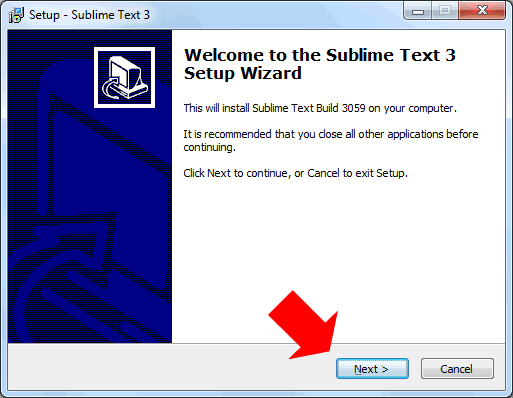

# Sublime Text 3

[Syncing](https://sublime.wbond.net/docs/syncing)

# Install on Windows



Open PowerShell by right-clicking and selecting Run as administrator

```
cd "$env:appdata\Sublime Text 3\Packages\"
mkdir "C:\Program Files\Sublime Text 3\Data"
mv User "C:\Program Files\Sublime Text 3\Data"
cmd /c mklink /D User "C:\Program Files\Sublime Text 3\Data"
cd "C:\Program Files\Sublime Text 3\"
git clone https://<username>@bitbucket.org/maqinainternet/sublime-text.git Data
```
