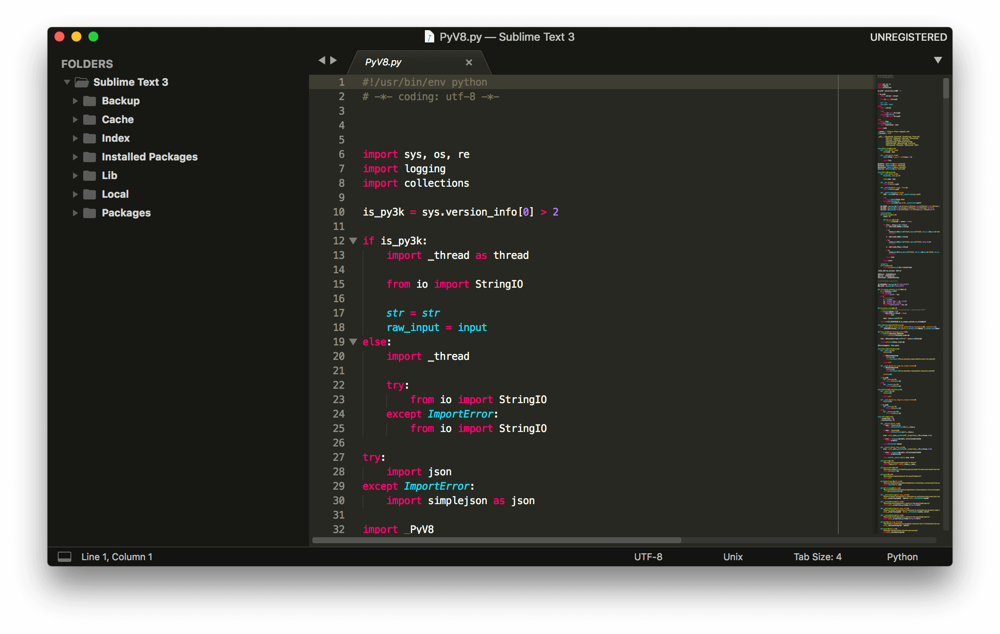

# Sublime Text 3

> Sublime Text is a sophisticated text editor for code, markup and prose. You'll love the slick user interface, extraordinary features and amazing performance.

## Install

### macOS

Download [`.dmg` installer](https://www.sublimetext.com/3) or using Homebrew `brew cask install sublime-text`

### Linux

Follow the [instructions](https://www.sublimetext.com/docs/3/linux_repositories.html) for your distribution.

### Windows

Download [`.exe` installer](https://www.sublimetext.com/3).

## Package Control

Follow [this](https://packagecontrol.io/installation#Simple) instructions (close Sublime Text after installation).

## My Preferences

### Dependencies

- Node.js (`npm install --global jshint eslint csslint lebab`)
- Ruby (`gem install scss_lint`)

### Install

- Navigate to `Packages` folder
  - macOS `cd ~/Library/Application Support/Sublime Text 3/Packages/`
  - Linux `cd ~/.config/sublime-text-3/Packages/`
  - Windows `cd "%appdata%/Sublime Text 3/Packages/"`
- Remove `User` folder
  - macOS and Linux `rm -rf User/`
  - Windows `rmdir User/`
- Clone this repository `git clone --recusive https://github.com/magnobiet/sublime-text-preferences.git User`

### Installed Packages

See [Package Control.sublime-settings#L6](Package%20Control.sublime-settings#L6)

## Licence

This project is licensed under the [MIT License](https://magno.mit-license.org/2014). Copyright © Magno Biét
